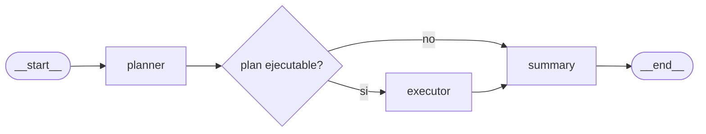

# IT Patagonia x Luka Cerrutti - GenAI task

<table align="center">
  <tr>
    <td valign="middle" align="center">
      
    </td>
    <td width="28"></td>
    <td valign="middle" align="center">
      
    </td>
  </tr>
</table>

Este proyecto implementa un orquestador agentico para un **Ingeniero DevOps Virtual**. Recibe pedidos en lenguaje natural, interpreta la intencion, planifica pasos seguros, ejecuta acciones simuladas con tools mockeadas y devuelve una traza auditable con estado final, TODOs, errores y recomendacion.

> [!IMPORTANT]
> **Recorte de scope:**
> Como `definicion.pdf` dejaba abierta la eleccion de dominio y no especificaba integraciones concretas, el alcance se acoto a un caso DevOps/cloud. El objetivo no es construir un chatbot generico ni provisionar infraestructura real, sino demostrar planificacion, ejecucion, retries, trazabilidad y comunicacion sobre un dominio tecnico claro.

## Arquitectura agentica

El flujo esta compuesto por tres agentes principales: `plannerAgent`, `executorAgent` y `summaryAgent`. LangGraph coordina el ciclo planificar, ejecutar, observar y resumir, cortando antes de ejecutar cuando faltan datos o cuando el pedido no es valido.

- **planner:** interpreta el pedido, valida si hay informacion suficiente y produce TODOs ejecutables.
- **route_after_planner:** decide si el plan puede pasar a ejecucion o debe ir directo al resumen.
- **executor:** ejecuta los TODOs en orden usando exclusivamente tools disponibles y reporta progreso incremental.
- **summary:** sintetiza el resultado final con estado, issues, TODOs, recomendacion y traza.

> [!NOTE]
> **Las tools son mockeadas:**
> El proyecto registra 25 tools DevOps simuladas, incluyendo creacion de buckets, bases de datos, VPN, firewall, IAM, backups, health checks, Kubernetes y Terraform. Todas devuelven respuestas locales en TOON, pueden modelar errores recuperables o definitivos, y el executor debe decidir retries o corte de ejecucion segun el resultado.

### Arquitectura de codigo

- `app/agents/planner.py`: define el prompt, schema y ejecucion del agente planificador.
- `app/agents/executor.py`: define el agente ejecutor, bindea tools y expone updates de TODOs en vivo.
- `app/agents/summary.py`: genera el resumen final sin inventar acciones ni resultados.
- `app/graph.py`: contiene el estado tipado, nodos LangGraph, routing, salida JSON y streaming SSE.
- `app/main.py`: adaptador FastAPI con endpoints `POST /json`, `POST /sse` y documentacion en `/docs`.
- `app/settings.py`: carga configuracion desde entorno y `.env`, incluyendo Novita, CORS y modo de runtime.
- `cli.py`: adaptador Typer que ejecuta el mismo grafo y devuelve el mismo contrato JSON.
- `app/tools/`: catalogo de tools DevOps mockeadas, sin llamadas a clouds reales.
- `web/`: interfaz estatica Astro para probar el stream SSE y visualizar mensajes, TODOs y actividad.
- `assets/`: logos e iconos usados por el README y la web.

#### Tooling en uso

El backend usa el ecosistema de LangChain para modelar agentes y tools, LangGraph para orquestar el flujo con estado explicito, y LangSmith para trazabilidad cuando se configuran las variables de tracing. Novita AI se usa mediante API compatible con OpenAI: `openai/gpt-oss-120b` corre en planner y summary por su foco en interpretacion/sintesis, mientras que `zai-org/glm-5.1` corre en executor por su rol de seleccion de tools y seguimiento de pasos.

##### Que mejoraria con mas tiempo

Las integraciones externas hoy son mocks locales, utiles para demostrar el flujo pero no para operar infraestructura real. Tambien agregaria fallback de provider/modelo LLM, persistencia backend del historial y endurecimiento del contrato API para que la conversacion no dependa principalmente del estado mantenido por el frontend.

## Como ejecutar

> [!TIP]
> **Web deployada:**
> La interfaz web esta disponible en https://patagonia.luka.software y la documentacion interactiva de la API en https://api.patagonia.luka.software/docs. Es la forma recomendada de probar el proyecto sin compartir API keys ni configurar entorno local. La API expone `POST /json` para obtener el reporte final y `POST /sse` para consumir eventos en tiempo real.

**Nota general:** Novita está un poco unreliable y a veces da error al usar structured ouputs con 120b. En caso de encarar este error, favor de reintentar. (Y por supuesto, en caso de llevar agentes a producción, usaremos un proveedor más confiable).

Para ejecutar localmente se puede usar la CLI, la API FastAPI o la API junto con la web Astro. En todos los casos hace falta una API key de Novita y conviene revisar el `makefile` para ver los comandos disponibles.

1. Instalar dependencias de sistema: `uv` para Python. Si se va a usar la web, instalar tambien `bun`.
2. Instalar dependencias del proyecto con `make install`.
3. Crear `.env` desde `.env.example` y completar al menos `NOVITA_API_KEY`. Opcionalmente completar `LANGSMITH_API_KEY` si se quiere tracing en LangSmith.

Para usar la CLI:

1. Ejecutar `make cli PROMPT="Crear un bucket S3 privado para staging"`.

Para usar solo la API:

1. Levantar la API con `make api`.
2. Abrir la documentacion local en `http://localhost:8000/docs`.
3. Probar `POST /json` para respuesta final o `POST /sse` para stream de eventos.

Para usar API + web local:

1. Levantar la API con `make api`.
2. En otra terminal, levantar la web con `make web`.
3. Abrir la URL local que imprime Astro y probar el flujo desde la interfaz.

Para verificar el proyecto:

1. Ejecutar `make check`.
